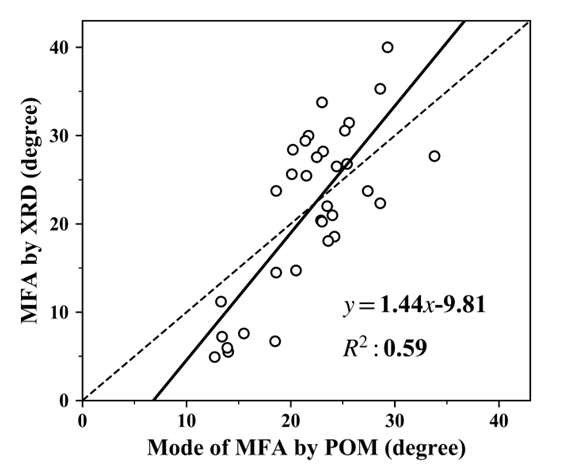
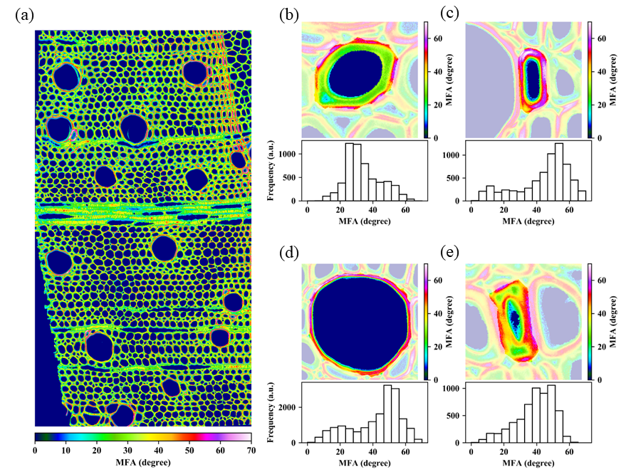
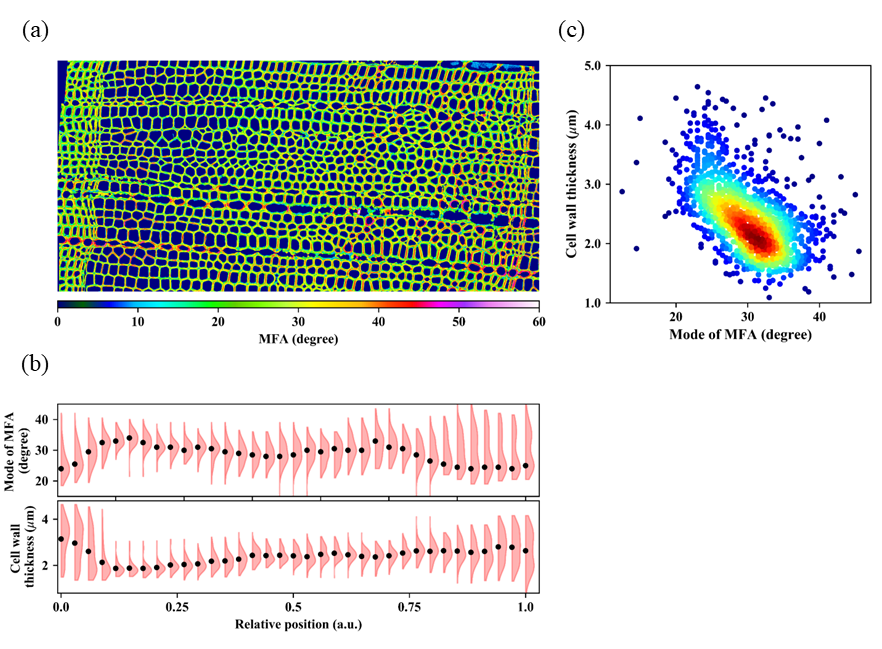

## Simultaneous cell-by-cell recognition and microfibril angle determination in Japanese hardwoods by polarized optical microscopy combined with semantic segmentation

-----

#### **Author**: 

Yusuke Kita1, Titis Setiyobudi1, Tatsuya Awano1, Arata Yoshinaga1, Junji Sugiyama1

#### **Affiliation**: 

1. Division of Forest and Biomaterials Science, Kyoto University, Kyoto, 606-8502, Japan

#### **Link to paper**

add link here.

-----

### 1. Brief Introduction

##### References

&nbsp;

----

### 2. Main results

#### Comparison of two methodologies, POM and XRD

This figure corresponds to a scatter plot, regression line of MFA measured by POM (x-axis) and XRD (y-axis). Our results clarified that MFA obtained by the both methodologies well coincide with each other within the wide range. Considering this result and their theoretical backgrounds, advantages and limitations of the both methods are discussed in our paper.

&nbsp;

#### Cell-by-cell MFA visualization by POM

&nbsp;

#### Relationships between MFA and CWT

&nbsp;

-----

### 3. About this repository

This repository contains all programing codes used in this work. Using these codes, the followings can be achieved if data is appropriately collected.  

1. Microfibril angle measurements from wood cross sections
   (see [class_funcs](https://github.com/pywood21/po_mfa_2023/tree/main/src/class_func/POM))
2. Automatic quantitative measurements of wood cell anatomical parameters such as cell area, lumen radial diameter, cell wall thickness, etc.
   (see [class_funcs](https://github.com/pywood21/po_mfa_2023/tree/main/src/class_func/Segmentation)))
3. Microfibril angle measurements using single crystal Xray diffractometer
   (see [class_funcs](https://github.com/pywood21/po_mfa_2023/tree/main/src/class_func/Xray))

&nbsp;

----

### 4. Required apparatus for data collection

Required apparatus for data collection are listed below. 

1. Polarized optical microscope equipped with a quarter wave plate, interference plate*1 and scientific CMOS camera.
2. Graphical processing unit for semantic segmentation tasks (if pretrained model is already prepared, this is not necessary)
3. single crystal Xray diffractometer

Details of the apparatus we used (manufactures, experimental conditions, etc.) are described in our paper (add external link). Details of the experimental procedure is well documented in the our previous work (see [our_paper](https://journals.plos.org/plosone/article?id=10.1371/journal.pone.0277616)).

&nbsp;

#### **Note**

*1) Interference filter is required due to the selection of appropriate incident light source wavelength for a quarter waveplate.

 

