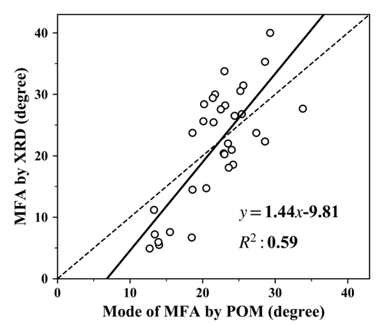
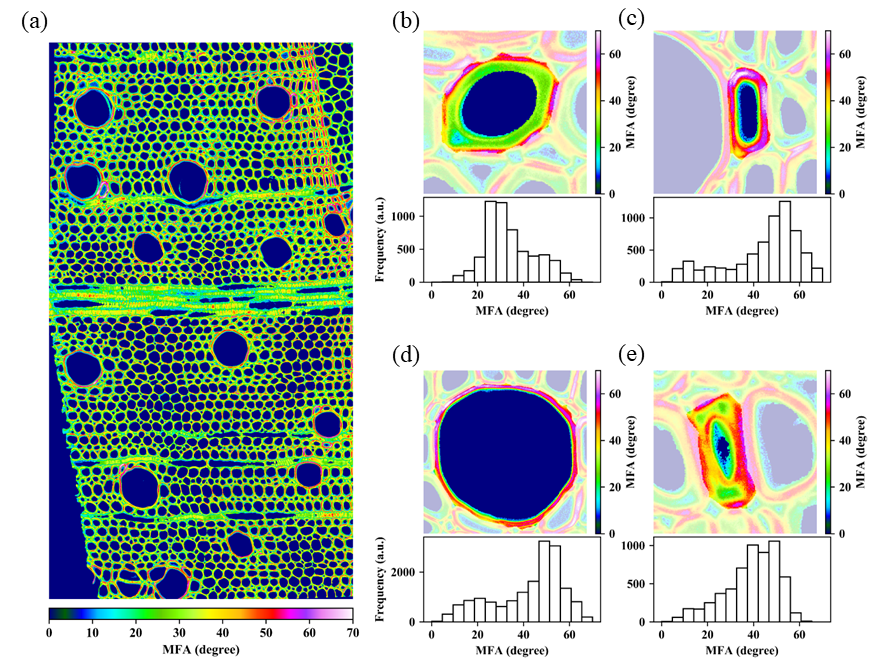
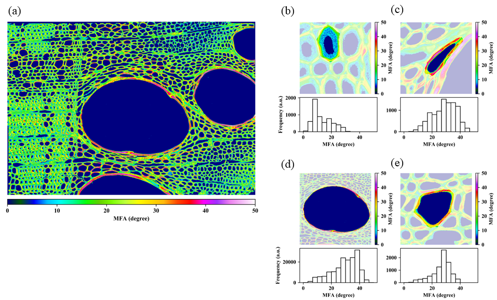
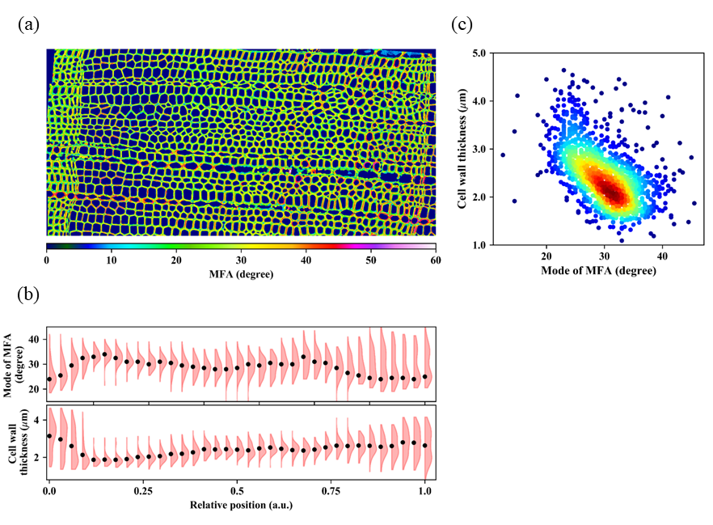
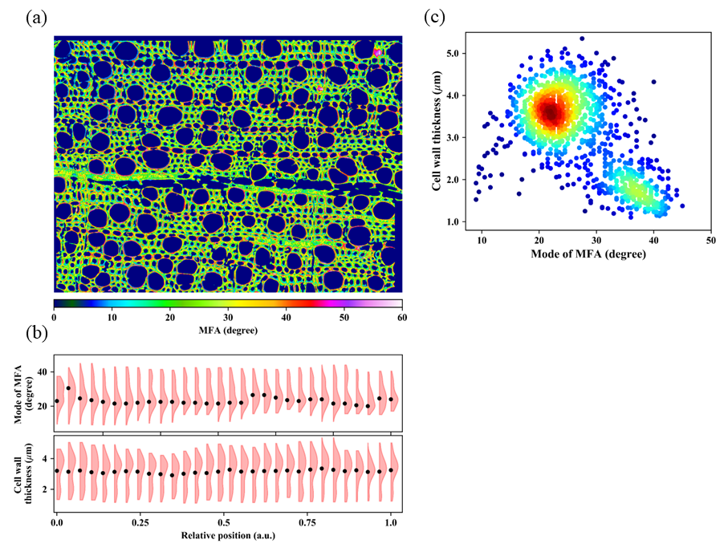
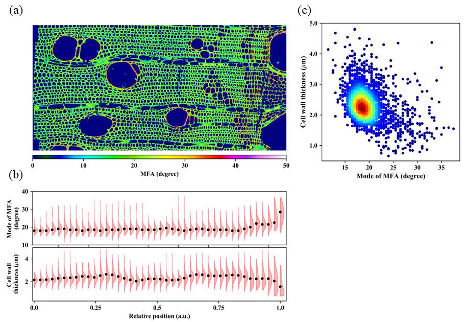
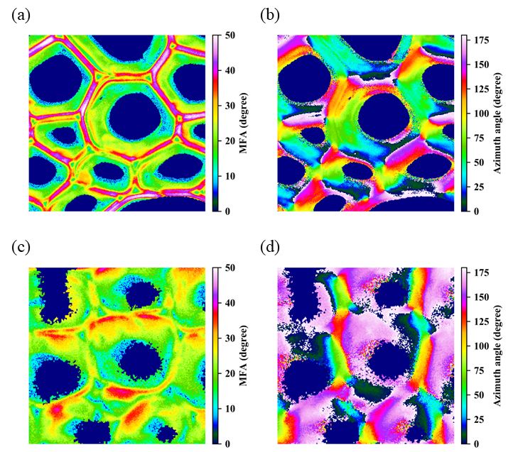
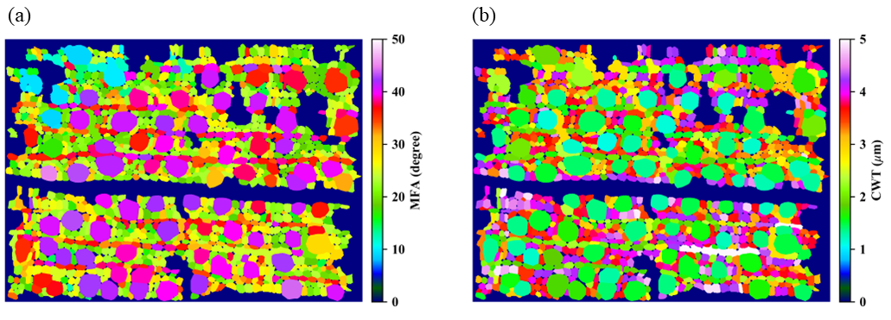
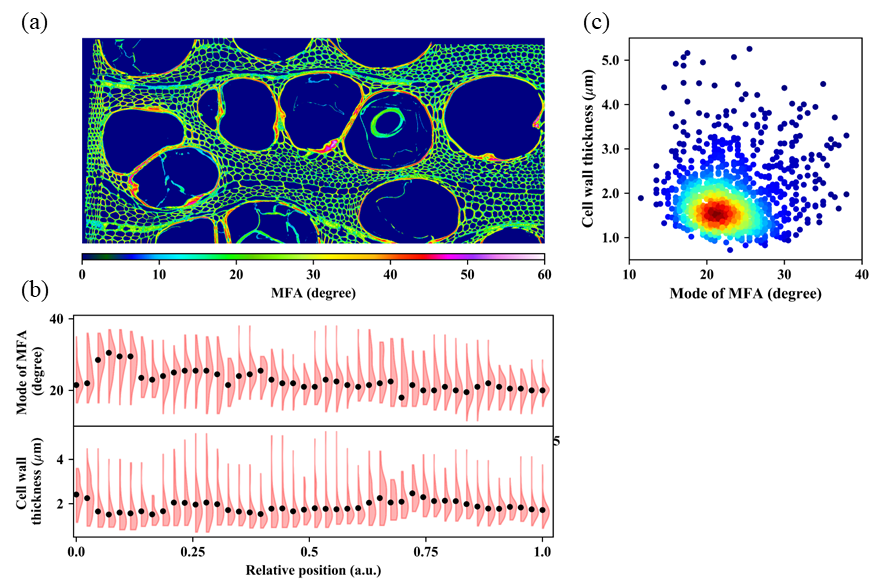

**Title**:

Elucidation of cell-by-cell cellulose microfibril angle and anatomy in various Japanese hardwood species by polarization optical microscopy and semantic segmentation

 

**Author information:**

**Author**:

Yusuke Kita1, Titis Setiyobudi1, Tatsuya Awano1, Arata Yoshinaga1, Junji Sugiyama1

**Affiliation**:

1) Division of Forest and Biomaterials Science, Kyoto University, Kyoto, 606-8502, Japan

**Email of corresponding author**: 

sugiyama.junji.6m@kyoto-u.ac.jp

**ORCID IDs**:

Junji Sugiyama: https://orcid.org/0000-0002-5388-4925

 &nbsp;

**Abstract**

Hardwood species have flourished in the present so that they have great diversity in cell anatomy, such as cell arrangement, cell species, ultrastructure and cellulose microfibril angle. These structural features should be measured simultaneously for integrating multiscale information in ideal. However, methodological restrictions have hampered the progression in this topic. To address this problem, this paper aims to measure and analyze cell-by-cell cellulose microfibril angle and anatomy of various Japanese hardwoods by using polarization optical microscopy based retardation imaging and deep learning based semantic segmentation techniques in order to achieve cell-by-cell microfibril angle imaging in the wide field of view. Microfibril angle imaging clearly showed that characteristic ultrastructure and microfibril angle distributions exist depending on wood species and cell species. In addition, our result implied that correlation between cell wall thickness and microfibril angle exists in some vesselless and ring-porous species. The combination of microfibril angle imaging and semantic segmentation provides us opportunities for getting insights of interrelationships among cellular characteristics in multiresolution.

 &nbsp;

**Keywords**

Cellulose microfibril angle, polarization optical microscopy, semantic segmentation, quantitative wood anatomy

 &nbsp;

**Introduction**

Hardwood species have flourished in the long evolutional history and dominate wide range of lands in the present earth. Various environmental conditions and fierce competitions have accelerated development of their diversity which is recorded as their morphologies of leaves, stems, roots, etc. Paying attention to their stems, traits of their diversity are saved as cell anatomy in multiscale orders from nm to mm.  

In the order of μm to mm, we can observe hardwood species specific features from various kinds of cell species, their proportions and unique three-dimensional arrangement. These characteristics have been categorized by wood anatomists based on qualitative microscopical observation and been utilized for wood identification (Panshin and De Zeeuw 1980; Wheeler et al. 1989, Calquist 2001). From nm to μm scales, multilayered ultrastructure (Wilfred and Côté 1965; Donaldson 2019) and orientational angle of cellulose microfibrils in each cell wall, generally called microfibril angle (MFA, Donaldson 2008), are the representative features. Especially, the most abundant S2 wall in the secondary cell wall have attracted the attentions of many scientists due to its large influence on wood physical and chemical properties (Lichtenegger et al. 1999; Barnett and Bonham 2004; Niklas and Spatz 2012). Although the above mentioned multiscaled structural features should be measured and quantified simultaneously for the better understanding of hardwood diversity in ideal, the restriction of available techniques hampered the progression of studies in this topic. However, two recent technical advances shed a new light on this theme.  

The first key technique is semantic segmentation. Deep learning based algorithms made recent great advances and play crucial roles in various application fields (Guo et al. 2018). Its high applicability and familiarity to microscopical images of plant or woody cells were proved by some reports achieving cell boundary prediction of plant tissues (Wolny et al. 2020), softwood tracheids (Chen et al. 2022) and vessel elements (Garcia-Pedrero et al. 2020). This technique paves the way for quantification of cell-by-cell anatomy combined with cell micrographs. The second key technique is retardation imaging using polarization optical microscopy (POM). Epoch-making technique was developed (Oldenbourg and Mei 1995; Oldenbourg 1996), and this enables us to observe faint optical anisotropy (retardation) in submicroscopic structures such as microtubules. This technique was recently imported to plant and wood sciences to measure MFA from cell cross sections, and showed its great potential in simultaneous evaluation of cell anatomy, cell wall ultrastructure and MFA variation in the wide field of view in herbaceous plants (Abraham and Elbaum 2013), softwood species (Kita et al. 2022) and bamboo (Hu et al. 2017).  

In this paper, we aim to simultaneously measure cell-by-cell MFA and cell anatomy and elucidate the both relationship by the combination of POM based MFA measurement and semantic segmentation based cell boundary prediction. For the above purpose, Japanese hardwood specimens with various anatomical characteristics (e.g. porosity) were prepared. In addition, we also conducted Xray diffraction (XRD) based MFA measurement for verifying the results of the MFA measurement by POM.  

 &nbsp;

**Experimental** 

**Materials** 

Japanese hardwood specimens, 16 families 18 genera 20 species in total, used in this experiment are listed in Table 1. All listed samples are stored in xyralium at the Research Institute for Sustainable Humanosphere, Kyoto University and can be identified by KYOw No (https://www.rish.kyoto-u.ac.jp/Xylarium/database2021). Except for *Sorbus commixta*, normal wood regions were sampled. Most of samples were collected from at least two regions for covering various anatomical features in earlywood and latewood. All samples were processed into cylindrical shapes with their diameter approx. 1mm*φ*. 

 &nbsp;

**Microfibril angle measurement by Xray diffraction** 

MFA values of the cylindrical samples were measured by XRD. XRD diagrams were recorded on a cylindrical image plate using a RAXIS RAPID II (Rigaku Corporation, Tokyo, Japan). The graphite monochromated Cu Ka radiation generated at 50 kV and 100 mA was collimated to 0.5 mm*φ* and incident to samples inclined by 17 degrees to detect diffraction from (004) planes. MFA values were obtained by Gaussian fitting applied to diffraction profiles of (004) planes.

 &nbsp;

**Microfibril angle measurement by polarization optical microscopy** 

All cylindrical wood sticks after XRD experiments were embedded in in Spurr resin (Spurr Low Viscosity Embedding Kit, Polysciences, Warrington, PA, USA). Their transverse sections with 3 µm thickness were cut by a rotary microtome (Sorvall JB-4, DuPont de Numours, Inc., Wilmington, DE, USA) and a diamond knife (Histo Jumbo, Diatome Ltd, Helmastrasse, Switzerland). Those sections were sandwiched by a cover and a slide glass with mounting agents, Bioleit (Okenshoji Co., Ltd., Tokyo, Japan) or Canada balsam. 

Detailed experimental procedure used in our experiment is described in our previous work (Kita et al. 2022). POM experiment was conducted for MFA measurement and fluorescence microscope (FLM) was utilized to extract pixels corresponding to cell walls by using the same cross section in each experiment. POM experiments following "three-frame algorithm without extinction setting" (Shribak & Oldenbourg 2003) were performed by using a polarization optical microscope (BX51-P, Olympus Corporation, Tokyo, Japan) equipped with a x40 objective (UPLFLN40XP, N.A.=0.75, Olympus Corporation), a 1/4 waveplate (UTP-137, Olympus Corporation) and an interference filter (45IF546, Olympus Corporation). All micrographs were taken by a monochrome CMOS camera (ORCA-Fusion BT, Hamamatsu Photonics Inc., Shizuoka, Japan. Image size: 2304 x 2304 pixels in width and height).  

Measurements of fluorescence micrographs were performed using a BX50 microscope equipped with a U-HGLGPS fluorescence illumination source (Olympus Corporation) and ×20 magnification objective lens (UPLANFL, NA = 0.50, Olympus Corporation) and fluorescent filter cubes U-MWU2 (excitation filter wavelength: 330-385 nm, emission filter wavelength: 420 nm, Olympus Corporation). All images were detected using a RGB color CCD camera (DP72, Olympus Corporation. Image size: 4140 × 3096 pixels in width and height).  

 &nbsp;

**Image analysis by sematic segmentation** 

POM images were converted into retardation, azimuthal angle images following the algorithm (Shribak and Oldenbourg 2003). After that, retardation images were converted to MFA images by using refractive indices of cellulose (*Δn* = 0.07, Iyer et al. 1968), cellulose composition in cell walls (Rowell 1984) and section thickness.  

The polarization and fluorescence micrographs were concatenated to one large image by Phase Only Correlation (POC) method (Ito et al. 2004). After image concatenation, image registration of the polarization and fluorescence micrographs were performed by Scale-Invariant Feature Transformation (SIFT, Lowe 2004). MFA values of each sample were obtained as histogram from MFA images after omitting lumen pixels by using binarized fluorescence micrographs. Finally, mean and mode of MFA values were calculated and summarized from the MFA histograms. Mode was obtained after kernel density estimation applied to the MFA histograms.  

Assignments of cell-cell boundary for obtaining cell by cell MFA and anatomy were performed by using deep learning based semantic segmentation technique (Garcia-Garcia et al. 2017). A part of MFA images was set as model input image and ground truth images were drawn by GIMP software (https://www.gimp.org/). U-Net model architecture (Ronneberger et al. 2015) was used in semantic segmentation. After the segmentation and manual correction, cell anatomical features such as cell and lumen transverse area, mean cell wall thickness, cell wall occupancy were extracted. Finally, cell-by-cell MFA distributions, their mean and mode were calculated and the relationships between anatomical parameter, only cell wall thickness (CWT) in this experiment, and MFA were analyzed.  

 &nbsp;

**Results and Discussion** 

**Comparison of MFA values obtained by the two different methodologies** 

Fig. 1 shows a scatter plot of results of MFA measurement by POM and those by XRD, and a result of regression analysis. The both methodologies display the same tendency in their MFA measurement values considering the coefficient of determination (*R*2=0.59). The slope and intercept of the regression line reveal that MFA obtained by POM tend to become larger than those by XRD. This tendency can be explained by differences of the both methodologies.  

In XRD, especially using diffractions from (004) planes, its profiles directly mirror inclination angles of cellulose microfibrils in each layer with different MFA. In our experiment, the only main peaks from S2 layer were considered to obtain MFA in XRD. On the other hand, POM based method indirectly measures MFA via retardation so that it is affected not only by MFA but also by chemical properties of cellulose microfibrils (Abraham and Elbaum 2013; Kita et al. 2022), such as cellulose compositions (Panshin and De Zeeuw 1980) and crystallinity (Müller et al. 2002) in each layer and cell species. The contributions from S2 and the other layers partly overlap in MFA histograms and it is hard to pure contributions of S2 MFA unlike XRD. In addition, MFA disturbance during section making also hamper the intact S2 MFA in POM method which frequently occurs in the thicker cell walls with the lower MFA (see Fig. S1). A lot of cares should be required in section making and handling data obtained by POM considering these pitfalls.  

 

 

**Fig.1** Scatter plots of MFA values obtained by Xray diffraction and polarization optical microscopy. Solid and dotted line corresponds to the regression line connecting data points and y = x, respectively. *R*2 indicates the coefficient of determination of the regression line. 

&nbsp;

**Ultrastructure and microfibril angle distributions of different cell species**  

In this section, MFA and ultrastructure of representative cell species in hardwoods, such as vessel, fiber, axial parenchyma, tracheid, are visualized and discussed. 

Fig.2 shows the entire MFA image of *Acer nipponicum*, and the its MFA images and histograms focusing on fiber, axial parenchyma surrounding vessel element (paratracheal parenchyma), axial parenchyma at latewood-earlywood boundary (terminal parenchyma) and fiber, respectively. Except for the fiber, the axial parenchyma and vessel element showed large MFAs. In their ultrastructure, the fiber and terminal parenchyma displayed clear three-layered structure but multilayered structures were not observed in vessel and paratracheal parenchyma. In addition, it is highly probable that the terminal parenchyma has the thicker S1 and S3 layers compared with the fiber owing to the distinct visible layer in the lumen side and the profile of MFA histogram. 

Fig.3 shows the entire MFA image of *Quercus serrata*, and the its MFA images and histograms focusing on fiber, vasicentric tracheid, earlywood and latewood vessel elements, respectively. In general trends, the vasicentric tracheid and both of vessel element showed the higher MFA compared with the fiber. S1 and S2 layers, and S1-S3 triple layers were visualized in fiber and latewood vessel element. On the contrary, clear multilayered structures were not observed in the vasicentric tracheid and earlywood vessel element. 

The obtained results well agree with direct observations by transmission electron microscopy (TEM) in the fiber and terminal parenchyma in *Acer* (Fujii et al 1980), and fiber, earlywood and latewood vessel elements in *Quercus* (Kim and Daniel 2016). A part of layers in the other cell species couldn’t be detected because these layers are too thin to be observed in the resolution used in this experiment. Hence, resolution limit of optical systems must be considered when the ultrastructure is discussed especially of thin wall cell species like vessel element (Preston 1974). 

In the both species discussed in this section, unique ultrastructure and MFA distributions can be obtained by POM depending on cell species. When utilizing this information, it may be helpful to distinguish cell species and to analyze their arrangement in cross sections. It should be noted that use of an objective lens with the higher magnification and to verify results of POM by TEM observation are recommended if the main purpose is to characterize multilayered structures in various cell types. 

 

**Fig.2** Cell-by-cell MFA image and distributions of various cell species in *Acer nipponicum*. (a) MFA image of the entire region (scale: 75 μm), expanded MFA image and MFA histograms of (b) fiber (scale: 5 μm), (c) axial parenchyma surrounding vessel element (paratracheal parenchyma, scale: 10 μm), (d) vessel element (scale: 15 μm) and (e) axial parenchyma located at latewood-earlywood boundary (terminal parenchyma, scale: 5 μm), respectively. Each MFA histogram is obtained from the exaggerated cell in each expanded MFA image. 

&nbsp;

**Fig.3** Cell-by-cell MFA image and distributions of various cell species in *Quercus serrata*. (a) MFA image of the entire region (scale: 100 μm), and expanded MFA image and MFA histograms of (b) fiber (scale: 10 μm), (c) vasicentric tracheid (scale: 15 μm) and (d) vessel element in earlywood (scale: 100 μm) and (e) in latewood (scale: 15 μm), respectively. Each MFA histogram is obtained from the exaggerated cell in each expanded MFA image.  

&nbsp;

**Relationship between microfibril angle and cell wall thickness** 

In this section, representative results are shown and discussed based on presence or absence of vessel element and category of vessel porosity (diffuse-porous and ring-porous, Wheeler 1989). 

 &nbsp;

1) Vesselless (*Trochodendron aralioides*) 

Fig.4 shows an MFA image, intra-annual transitions of MFA and CWT, and their relationship in *Trochodendron aralioides*, respectively. This vesselless species has anatomical features similar to softwoods which display large anatomical difference between earlywood and latewood in cell diameter, CWT and lumen area as seen in Fig.5 (a) and (b). In latewood-earlywood boundary (relative position: 0.1), radical increase of MFA and decrease of CWT were observed. The higher MFA and thinner CWT were kept in earlywood (relative position: 0.1-0.25). In earlywood-latewood transition and latewood (relative position: 0.25-1.0), the both MFA and CWT fluctuated, and MFA showed clear decrement (relative position: 0.7-1.0). The distribution ranges of the both MFA and CWT became larger in transition and latewood due to the existence of axial parenchyma. The scatter plot of MFA vs CWT indicated mild liner relationship (Pearson correlation coefficient *R*: -0.52). 

**Fig.4** Intra-annual fluctuations of MFA and cell wall thickness, and relationship between the both indices in *Trochodendron aralioides* (vesselless). (a) MFA image (scale: 100 μm), (b) half-violin plots of intra-annual trends of MFA (top row) and cell wall thickness (bottom row) and (c) a scatter plot of MFA vs cell wall thickness, respectively. In the half-violin plots, relative position indicate that left and right sides of the MFA image are set to 0 and 1, respectively. Black dots of each violin plot display the mode of each distribution. In the scatter plot, reddish and bluish colors correspond to high and low data densities calculated by kernel density estimation, respectively. Number of cells whose MFA and cell wall thickness were measured is 1141 in total. 

&nbsp;

2) Diffuse-porous (*Viburnum furcatum*) 

Fig.5 shows an MFA image, transitional behaviors of MFA and CWT, and their relationship in *Viburnum furcatum*, respectively. The both MFA and CWT fluctuated within an annual ring but kept the almost constant values throughout the year. In the scatter plot, data points were divided into two clusters, cells with the lower MFA and thicker CWT and those with the higher MFA and thinner CWT. Visualization of MFA and CWT of each cell on the image revealed that the former and latter are assigned to fibers and the mix of ray parenchyma and vessel element, respectively (see Fig. S2). The cluster of fibers didn’t show any correlation. Okano et al. (1972) reported intra-annual MFA and cell length transitions of ring-porous *Fagus crenata* that earlywood and latewood have the almost same MFA values of fibers in this species. The same tendencies were observed in almost all ring-porous species except for *Cornus controversa* with cell wall thickness variation. 

 

**Fig.5** Intra-annual fluctuations of MFA and cell wall thickness, and relationship between the both indices in *Viburnum furcatum* (diffuse-porous). (a) MFA image (scale: 100 μm), (b) half-violin plots of intra-annual trends of MFA (top row) and cell wall thickness (bottom row), (c) a scatter plot of MFA vs cell wall thickness, respectively. In the half-violin plots, relative position indicate that left and right sides of the MFA image are set to 0 and 1, respectively. Black dots of each violin plot display the mode of each distribution. In the scatter plot, reddish and bluish colors correspond to high and low data densities calculated by kernel density estimation, respectively. Number of cells whose MFA and cell wall thickness were measured is 1225 in total. 

&nbsp;

3) Ring-porous (*Rhus javanica*) 

Fig.6 shows an MFA image, transitional behaviors of MFA and CWT, and their relationship in *Rhus javanica*, respectively. MFA and CWT fluctuated and kept constant values in transition and latewood (relative position: 0.0-0.9). The thin-walled fibers displayed the higher MFA in earlywood (relative position: 0.9-1.0). Another MFA image capturing earlywood also showed the higher MFA (around 25-30 degrees) in the thin-walled fibers (see Fig. S3). The scatter plot of MFA vs CWT indicated the weak correlation between them (*R*: -0.36). Their mutual relationship was also seen in species with wall thickness variation, such as *Quercus* and *Phellodendron amurense*. 

**Fig.6** Transitional behaviors of MFA and cell wall thickness, and relationship between the both indices in *Rhus javanica* (ring-porous). (a) MFA image (scale: 100 μm), (b) half-violin plots of transitional trends of MFA (top row) and cell wall thickness (bottom row), (c) a scatter plot of MFA vs cell wall thickness, respectively. In the half-violin plots, relative position indicate that left and right sides of the MFA image are set to 0 and 1, respectively. Black dots of each violin plot display the mode of each distribution. In the scatter plot, reddish and bluish colors correspond to high and low data densities calculated by kernel density estimation, respectively. Number of cells whose MFA and cell wall thickness were measured is 2538 in total. 

&nbsp;

 Summarizing the results, vesselless *Trochodendron aralioides* and a part of ring-porous species with CWT variations exhibited correlations between MFA and CWT. The most of ring-porous species didn’t show clear correlation between them. It is reasonable trend in *Trochodendron aralioides* because of its anatomical similarity to softwoods (Kita et al. 2022). Intriguing result is that variations and weak correlation between MFA and CWT in fibers of some ring-porous species exist. In this point, the more studies are required by means of not only simultaneous measurement of cell anatomies, but also from other perspectives like genetic and plant hormones in order to seek their causal relationships. 

Although a lot of works have been done relating to MFA of useful softwoods and hardwoods in industry (Donaldson 2008), there are only a few works to measure cell-by-cell intra-annual MFA and CWT transitions obtained from several thousands of cells in both softwoods and hardwoods as shown in this study. In the present status, POM based MFA measurement combined with semantic segmentation image analysis is the only way to realize systematical analysis of exploring MFA and cell anatomy in the transverse dimension and discussing the effects of external environment and genetics on them from cell anatomical perspectives. 

&nbsp;

**Conclusions** 

This work displayed diversity of hardwood species from the perspective of cell-by-cell MFA and anatomy, and their relationships. MFA image and histograms described the cell species specific ultrastructural features depending on wood species. In addition, the combination of the semantic segmentation technique showed applicability to elucidate relationships between MFA and cell transverse anatomical parameters (Donaldson 2008). Our results suppose the possibility that MFA correlates with cell wall thickness of tracheids in vesselless *Trochodendron aralioides* and of fibers in a part of ring-porous species like *Rhus javanica*. 

The great advantages of POM based MFA measurement are to enable us to simultaneous evaluation of MFA and other anatomical or chemical characteristics combined with various microscopical, topochemical techniques and image analysis, such as ultraviolet microscopy (Scot et al. 1969), Raman microscopy (Gierlinger 2018), immunolocalization (Donaldson and Knox 2012) and deep learning based semantic segmentation (Hwang and Sugiyama 2021). Finally, we hope that the combination of POM and semantic segmentation techniques will accelerate studies in plant and wood science fields and deepen our understandings in the relationships of cell anatomies in multiresolution orders. 

 &nbsp;

**Acknowledgements** 

This study was supported by Grants-in-Aid for Scientific Research on Innovative Area (grant number 18H05485). 

 &nbsp;

**References** 

> Abraham Y, Elbaum R (2013) Quantification of microfibril angle in secondary cell walls at subcellular resolution by means of polarized light microscopy. New Phytol 197: 1012-1019. https://doi.org/10.1111/nph.12070

> Bernett JR, Bonham VA (2004) Cellulose microfibril angle in the cell wall of wood fibres. Biol Rev 79: 461-472. https://doi.org/10.1017/S1464793103006377

> Calquist S (2001) Comparative wood anatomy. Systematic, ecological, and evolutionary aspects of dicotyledon wood. Springer, Berlin.

> Chen S, Awano T, Yoshinaga A, Sugiyama J (2022) Flexural behavior of wood in the transverse direction investigated using novel computer vision and machine learning approach. Holzforschung 76: 875-885. https://doi.org/10.1515/hf-2022-0096

> Donaldson L (2008) Microfibril angle: measurement, variation and relationships - A review. IAWA J 29: 345-386. https://doi.org/10.1163/22941932-90000192

> Donaldson LA, Knox JP (2012) Localization of cell wall polysaccharides in normal and compression wood of radiata pine: relationships with lignification and microfibril orientation. Plant Physiol 158: 642-653. https://doi.org/10.1104/pp.111.184036

> Donaldson LA (2019). Wood cell wall ultrastructure. The key to understanding wood properties and behaviour. *IAWA J* *40:* 645-672. https://doi.org/10.1163/22941932-40190258

> Fujii T, Harada H, Saiki H (1980) The layered structure of secondary walls in axial parenchyma of the wood of 51 Japanese angiosperm species. Mokuzai Gakkaishi 26: 373-380. 

> Garcia-Garcia A, Orts-Escolano S, Oprea S, Villene-Martinez V, Garcia-Rodoriguez J (2017) A review on deep learning techniques applied to semantic segmentation. arXiv:1704.0857 [cs.CV]. https://doi.org/10.48550/arXiv.1704.06857

> Garcia-Pedrero A, García-Cervigón AI, Olano JM, García-Hidalgo M, Lillo-Saavedra M, Gonzalo-Martín C, Caetano C, Calderón-Ramírez S (2020) Convolutional neural networks for segmenting xylem vessels in stained cross-sectional images. Neural Comput Appl 32: 17927-17939. https://doi.org/10.1007/s00521-019-04546-6

> Guo Y, Liu Y, Georgiou T, Lew MS (2018) A review of semantic segmentation using deep neural networks. Int J Multimed Inf Retr 7: 87-93. https://doi.org/10.1007/s13735-017-0141-z

> Gierlinger N (2018) New insights into plant cell walls by vibrational microspectroscopy. Appl Spectrosc Rev 53: 517-551. https://doi.org/10.1080/05704928.2017.1363052

> Hu K, Huang Y, Fei B, Yao C, Zhao C (2017) Investigation of the multilayered structure and microfibril angle of different types of bamboo cell walls at the micro/nano level using a LC-PolScope imaging system. Cellulose 24: 4611-4625. https://doi.org/10.1007/s10570-017-1447-y

> Hwang SW, Sugiyama J (2021) Computer vision-based wood identification and its expansion and contribution potentials in wood science: a review. Plant Methods 17: 47. https://doi.org/10.1186/s13007-021-00746-1

> Ito K, Nakajima H, Kobayashi K, Aoki T, Higuchi T (2004) A fingerprint matching algorithm using phase-only correlation. IEICE Trans Fundam Electron Commun Comput Sci E87-A: 682–691.

> Iyer KRK, Neelakantan P, Radhakrishnan T (1968) Birefringence of native cellulose fibers. I. Untreated cotton and ramie. J Polym Sci Part A-2 Polym Phys 6: 1747–1758. https://doi.org/10.1002/pol.1968.160061005

> Kim JS, Daniel G (2016) Variations in the cell wall ultrastructure and chemistry in cell types of earlywood and latewood in English oak (*Quercus robur*). IAWA J 37: 383-401. https://doi.org/10.1163/22941932-20160142

> Kita Y, Awano T, Yoshinaga A, Sugiyama J (2022) Intra-annual fluctuation in morphology and microfibril angle of tracheids revealed by novel microscopy-based imaging. Plos One 17: e0277616. https://doi.org/10.1371/journal.pone.0277616

> Lichtenegger H, Reiterer A, Stanzl-Tschegg SE, Fratzl P (1999) Variation of cellulose microfibril angles in softwoods and hardwoods – a possible strategy of mechanical optimization. J Struct Biol 128: 257-269. https://doi.org/10.1006/jsbi.1999.4194

> Lowe, DG. (2004) Distinct image features from scale-invariant keypoints. Int J Comput Vis 60: 91–110. https://doi.org/10.1023/B:VISI.0000029664.99615.94

> Müller M, Hori R, Itoh T, Sugiyama J (2002) X-ray microbeam and electron diffraction experiments on developing xylem cell walls. Biomacromolecules 3: 182-186. https://doi.org/10.1021/bm015605h

> Niklas KJ, Spatz HC (2012) Plant physics. The University of Chicago Press, Chicago.

> Okano T, Onuki S, Hirai S (1972) On the distributions of micellar angle and the fiber length in the trunk of Buna wood (in Japanese). Mokuzai Gakkaishi 18: 629-633.

> Oldenbourg R, Mei G (1995) new polarized light microscope with precision universal compensator. J Microsc 180: 140-147. https://doi.org/10.1111/j.1365-2818.1995.tb03669.x

> Oldenbourg R (1996) A new vision on polarization microscopy. Nature 381: 811-812. https://doi.org/10.1038/381811a0

> Panshin AJ, De Zeeuw C (1980) Textbook of wood technology. Structure, identification, properties, and use of commercial woods of the United States and Canada. Fourth edition. McGraw-Hill, New York.

> Preston RD (1974) The physical biology of plant cell walls. Chapman and Hall, London.

> Ronneberger O, Fischer P, Brox T (2015). U-Net: convolutional networks for biomedical image segmentation. In: Medical image computing and computer-assisted intervention (MICCAI), Vol. 9351. Springer, Cham, LNCS, pp. 234–241. arXiv:1505.04597 [cs.CV]. https://doi.org/10.48550/arXiv.1505.04597

> Rowell R (1984) The chemistry of solid wood. American Chemical Society, Washington.

> Scot JAN, Procter AR, Fergus BJ, Goring DAI (1969) The application of ultraviolet microscopy to the distribution of lignin in wood. Description and validity of the technique. Wood Sci Technol 3: 73-92. https://doi.org/10.1007/BF00349985

> Shimaji K, Sudo S, Harada H (2016) Mokuzai no Soshiki (Wood anatomy, in Japanese). Morikita Publishing, Tokyo.

> Shribak M, Oldenborug R (2003) Techniques for fast and sensitive measurements of two-dimensional birefringence distributions. Appl Opt 42: 3009-3017. https://doi.org/10.1364/AO.42.003009

> Wheeler E, Baas P, Gasson P (1989) IAWA list of microscope features for hardwood identification. IAWA J 10: 219-332.

> Wilfred A, Côté JR (1965) Cellular ultrastructure of woody plants. Syracuse University Press, New York.

> Wolny A, Cerrone L, Vijayan A, Tofanelli R, Barro AV, Louveaux M, Wenzl C, Strauss S, Wilson-Sánchez D, Lymbouridou R, et al. (2020). Accurate and versatile 3D segmentation of plants tissues at cellular resolution. Elife 9: e56713. https://doi.org/10.7554/eLife.57613

 &nbsp;

**Statements & Declarations** 

**Funding** 

This study was supported by Grants-in-Aid for Scientific Research on Innovative Area (grant number 18H05485).

 &nbsp;

**Competing Interests** 

The authors have no relevant financial or non-financial interests to disclose. 

 &nbsp;

**Author contributions** 

Junji Sugiyama mainly contributed to the study conception and design. Material preparation, and MFA measurement by Xray diffraction and its analysis were conducted by Titis Setiyobudi and Junji Sugiyama. MFA measurement by polarization optical microscopy, image analysis and data curation were performed by Yusuke Kita. The first draft of the manuscript was written by Yusuke Kita and Junji Sugiyama. Tatsuya Awano, Arata Yoshinaga and Junji Sugiyama supervised this work. All authors read and approved the final manuscript. 

 &nbsp;

**Table** 

Table 1 Hardwood samples information. 

| **Family**       | **Genus  and Species**                | **KYOw  IDs** | **Number  of measurement positions** |
| ---------------- | ------------------------------------- | ------------- | ------------------------------------ |
| Aceraceae        | *Acer nipponicum*                     | 11627         | 2                                    |
|                  | *Acer rufinerve*                      | 09560         | 1                                    |
| Anacardiaceae    | *Rhus javanica*                       | 09555         | 2                                    |
| Aquifoliaceae    | *Ilex macropoda*                      | 09556         | 2                                    |
| Araliaceae       | *Acanthopanax  sciadophylloides*      | 09570         | 1                                    |
|                  | *Evodiopanax innovans*                | 11633         | 2                                    |
| Betulaceae       | *Carpinus  tschonoskii*               | 09532         | 2                                    |
| Celastraceae     | *Euonymus alatus*                     | 09558         | 2                                    |
| Cornaceae        | *Cornus  controversa*                 | 10375         | 2                                    |
| Fagaceae         | *Quercus salicina*                    | 09538         | 1                                    |
|                  | *Quercus serrata*                     | 09537         | 1                                    |
| Hydrangeaceae    | *Hydrangea petiolaris*                | 09545         | 1                                    |
| Lamiaceae        | *Clerodendrum  trichotomum*           | 09579         | 2                                    |
| Magnoliaceae     | *Magnolia salicifolia*                | 09541         | 1                                    |
| Oleaceae         | *Farxinus  lanuginose* var. *serrata* | 09578         | 2                                    |
| Rosaceae         | *Sorbus commixta*                     | 09550         | 1                                    |
|                  | *Phellodendron  amurense*             | 09552         | 2                                    |
| Rutaceae         | *Zanthoxylum ailanthoides*            | 09551         | 1                                    |
| Trochodendraceae | *Trochodendron  aralioides*           | 09540         | 2                                    |
| Viburnaceae      | *Vibrnum furcatum*                    | 10378         | 2                                    |

 

**Supporting information**

**Fig. S1** MFA and azimuth angle images with and without sectioning artifacts. (a) MFA and (b) azimuth angle images of fibers of *Carpinus tschonoskii* without sectioning artifacts (scale: 10 μm), and (c) MFA and (b) azimuth angle images of fibers of *Quercus salicina* with sectioning artifacts (scale: 5 μm). In (b), azimuthal angle values cyclically transition from 0 to 180 degrees. In (d), azimuthal values show only near 0 or 180 degrees. This occurs because MFA is not kept during section making and cellulose microfibrils are forced to tilt along with the sectioning direction (horizontal direction of the images in the both species). 

&nbsp;

 

**Fig. S2** Visualization of cell-by-cell MFA and cell wall thickness of *Viburnum furcatum*. (a) Cell-by-cell MFA and (b) cell wall thickness images (scale: 100 μm). 

 &nbsp;

**Fig. S3** Transitional behaviors of MFA and cell wall thickness, and relationship between the both indices in earlywood of *Rhus javanica* (ring-porous). (a) MFA image (scale: 100 μm), (b) half-violin plots of transitional trends of MFA (top row) and cell wall thickness (bottom row), (c) a scatter plot of MFA vs cell wall thickness, respectively. In the half-violin plots, relative position indicate that left and right sides of the MFA image are set to 0 and 1, respectively. Black dots of each violin plot display the mode of each distribution. In the scatter plot, reddish and bluish colors correspond to high and low data densities, respectively. 